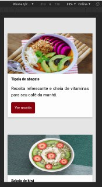

# arquitetura-css
Curso de arquitetura (Atomic / BEM) da Alura. 

Demo:  
https://gabrieldarezzo.github.io/fruta_fruto/  

Demo-Screen (Mobile):  
  

Protótipo-Figma: https://www.figma.com/file/0gMF5BPgplPYqQA6Om1T1sk9/alura-bootstrap?node-id=0%3A1

## Links para apoio  

### Figma:
https://www.figma.com/file/0gMF5BPgplPYqQA6Om1T1sk9/alura-bootstrap?node-id=0%3A1

### ProjetoBase:  
https://github.com/mahenrique94/curso-alura-arquitetura-css/tree/master/assets